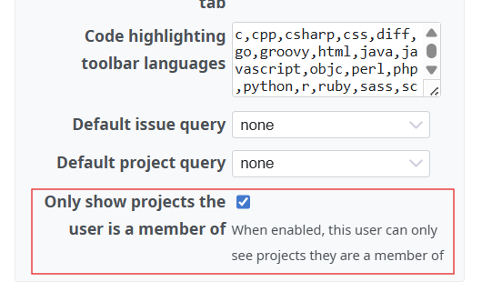

# Redmine Member Only Projects Plugin

## 概要

特定のユーザーに対して自分がメンバーであるプロジェクトのみを表示できるようにします。この設定が有効なユーザーは、メンバーとなっていない公開プロジェクトを見ることはできません。公開プロジェクトを特定のユーザーから隠したい場合などに利用できます。

**⚠️注意:** このプラグインはRedmineの権限ロジックをカスタマイズします。誤った設定や不具合がある場合、意図しない情報漏洩などのリスクが生じる可能性があります。ご利用の際は十分にご注意いただき、本番環境に導入する前に必ず十分な動作確認を行ってください。

## 特長

- **メンバー限定表示**: 指定したユーザーに対し、メンバーであるプロジェクトのみを表示します
- **全ての認証設定に対応**: 「認証が必要」の設定に関わらず、どちらの環境でも機能します
- **柔軟な設定**: ユーザーごとにユーザー設定で制限の有無を設定可能です
- **DBマイグレーション不要**: Redmine 標準の UserPreference を使用するため、プラグイン独自のテーブルは使用しません

## インストール

1. プラグインを Redmine の plugins ディレクトリに配置します。

   ```
   cd /path/to/redmine/plugins
   git clone https://github.com/sk-ys/redmine_member_only_projects.git
   ```

2. Redmine を再起動します。

## 設定方法

### プラグインの動作

#### 「認証が必要」が `はい` の場合 (`login_required=true`):
- member_only ユーザーが見られるのは **メンバーであるプロジェクトのみ** です
- 公開プロジェクトはメンバーでない限り表示されません

#### 「認証が必要」が `いいえ` の場合 (`login_required=false`):
- member_only ユーザーが見られるのは **メンバーであるプロジェクト** および **匿名ユーザーがアクセス可能なプロジェクト** です
- Issue の表示範囲も同じロジックに従います: ユーザーがメンバーである OR 匿名ユーザーが Issue を閲覧できる場合に表示されます
- これにより、匿名ユーザーの権限制限が member_only ユーザーにも適切に反映されます

### セットアップ手順

#### ユーザーの「メンバーのみのプロジェクト」設定を有効にする

**管理 → ユーザー** からユーザーの編集画面を開き、「設定」セクションにある **「メンバーのみのプロジェクト」** にチェックを入れます。



## 動作要件

- Redmine 6 以上

## ライセンス

このプラグインは GPLv2 ライセンスで公開されています。
